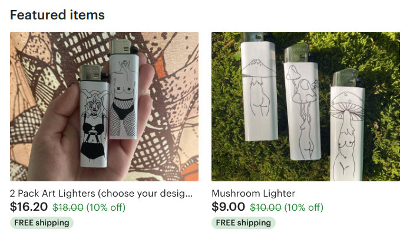

# jegs, wassup

so heres the email, heres what were gonna do

first keyterm: `Component`

components can be nested inside of others  
lets make some nested components: `List` & `List_Item`

the `List` creates `List_Item` s, based on an input  

heres an example from your etsy:
	


``` html
<!-- above component -->

<header>Featured items<header>
<List forEach=Featured[2] />
	<List_Item />
		
		<header =title>
		<price =price*discount>
		<shipping =true>
	</>
</>

```

``` js
featured: [{
	image: './lighter-pair.png',
	title: '2 Pack Art Lighters (choose your design...',
	price: 18,
	discount: .1,
	shipping: true,
},{
	image: './lighter-mushroom.png',
	title: 'Mushroom Lighter',
	price: 10,
	discount: .1,
	shipping: true,
}]
```

so what i want to do is 

create you two components: a List and a List_Item

